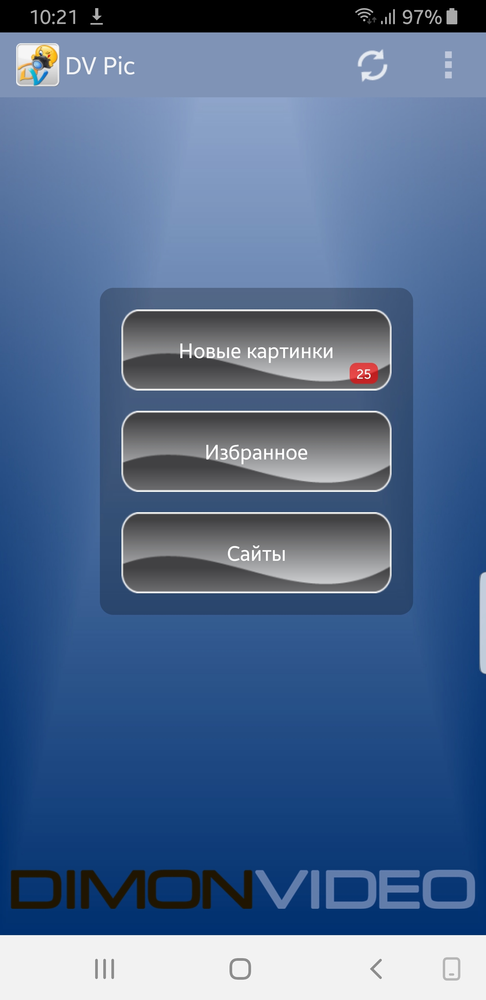

# DVPic

Программа для поднятия настроения - показывает демотиваторы и прикольные картинки 😄
Загружаются с сайта - примерно 40-60 в сутки. Есть возможность просмотра в режиме оффлайн.
Ежедневные обновления картинок, есть автоматическая загрузка через указанный интервал времени и выбор типа сети, для просмотра прикольных картинок в удобное время, без наличия интернета.

Возможности:
- виджет с количеством новых картинок;
- вывод общей ленты новинок;
- возможность добавления картинок в избранное;
- автозагрузка картинок по расписанию для оффлайн просмотра;
- возможность отправлять картинки, сохранять, открывать во внешних приложениях;
- возможность открывать страницу с картинкой для комментариев;
- настройки внешнего вида окна просмотра картинок;
- листание пальцами или кнопками громкости;
- выход из приложения если дальше нет картинок в ленте Новинок.

Для включения автоматической загрузки изображений, зайдите в Настройки приложения и выберите интервал автозагрузки, и предпочитаемую сеть передачи данных.
Приложению требуется разрешение на доступ к памяти устройства.
-----------------
Разработчик: DimonVideo - с версии 1.6, до меня - Albert927, а начинал Владимир Куц до версии 1.48.
Автор иконки: Igorka
GooglePlay: ссылка
Версия: 1.89
Обновлено: 23 мая 2020г
